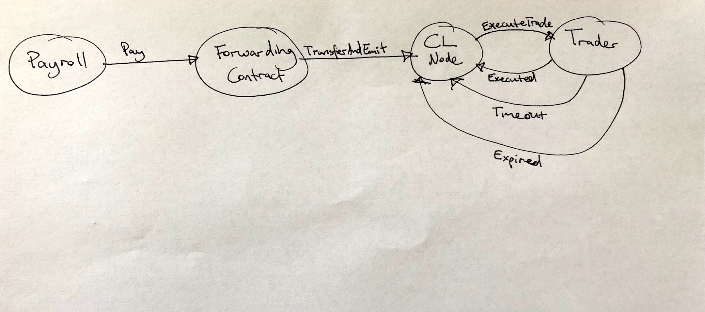

# pancake

pancake flattens volatility in ETH -> USD payments

This is a simple hack day project which aims to solve a very simple problem,
using chainlink:

  1. Receive some ETH at an address
  2. Automatically transfer that ETH to an exchange wallet
  3. Sell that ETH for USD at the exchange

# Who

 @j16r and @rupurt

# What

So far the plan is to have:

  1. A receiving Solidity contract, that upon transfer of some ETH, transfers to a new target address (your exchange's wallet) and creates a RunLog for chainlink
  2. A JobSpec that listens for the above RunLog and triggers an external adaptor
  3. A small service, likely written in Node/JS, that upon triggering by chainlink, will watch for the amount to be deposited in the exchange, then trigger a sell.

# How

So how do you use this? First you'll need:

  1. node + npm, version
  2. a running ethereum node, with RPC listening on 18545
  3. an ethereum wallet to get ETH shipped to

Directions:

  1. Create an ethereum account, with geth you can do `geth account new`
  2. Migrate the job spec and contract with: `WALLET_ADDRESS=$YourWalletAddress npm run deploy`
  3. Transfer some coins to your contract address!
